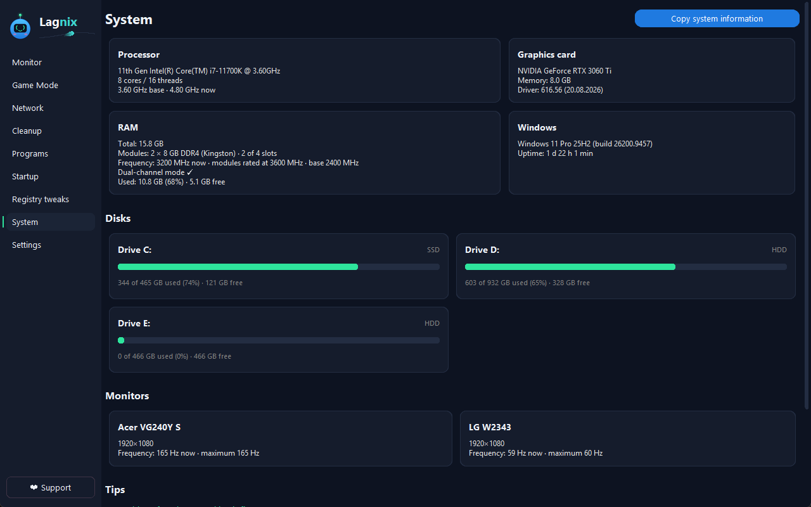
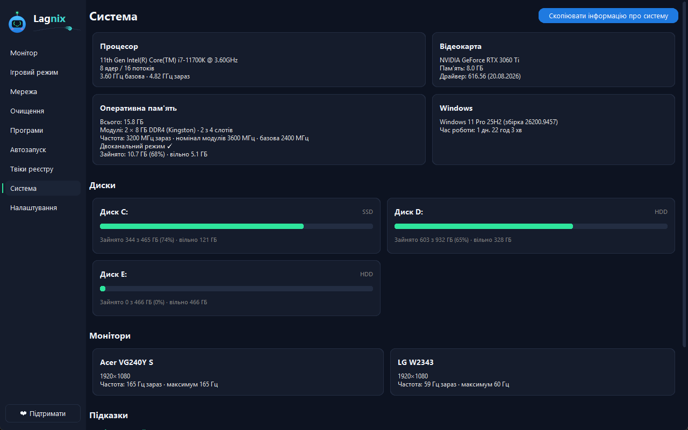

# Lagnix

[](https://github.com/Lagnix-app/lagnix/actions/workflows/build.yml)

**English** · [Українська](#українська)

Lagnix is a free Windows utility for gamers: live system monitor, Game Mode, network
quality tests, cleanup, autostart manager and safe registry tweaks — in one small app.

Support the author: [Ko-fi](https://ko-fi.com/lagnix) · [itch.io](https://lagnixapp.itch.io/lagnix)

## Features

- **Monitor** — CPU, GPU, RAM, disks, network, temperatures, processes grouped by app.
- **Game Mode** — closes background apps, switches the power plan, per-game profiles, auto-enable when a game starts.
- **Network** — ping, jitter and packet loss tests with history.
- **Cleanup** — temp files, caches, large files finder.
- **Programs / Autostart** — uninstall apps, enable/disable startup entries.
- **Registry tweaks** — performance tweaks with automatic backups and restore points.
- **System** — hardware info.
- In-game **overlay**, global **hotkeys**, tray icon, Windows notifications.
- **12 languages**, detected from Windows.

## Screenshots

| Monitor | Game Mode | Cleanup |
|---|---|---|
|  |  |  |

| Network | Programs | Registry tweaks |
|---|---|---|
|  |  |  |

| System |
|---|
|  |

## Requirements

- Windows 10 or 11 (64-bit)
- Administrator rights (cleanup of system folders, power plans, registry tweaks, CPU temperature)
- To run from source: Python 3.12+

## Installation

- **Release:** download from [itch.io](https://lagnixapp.itch.io/lagnix) and run it.
- **From source:**
  ```
  pip install -r requirements.txt
  python main.py
  ```
  Set `LAGNIX_DEBUG=1` for debug output.

`settings.json` and `data.json` are created automatically on first run. The installed version stores them (together with `backups/` and `logs.txt`) in `%APPDATA%\Lagnix`; when run from source — next to the app.

## Safety

- Registry changes are **backed up** first and can be reverted; a **system restore point** is offered before risky actions.
- Processes are closed or files deleted **only after you press a button and confirm**; scans are read-only.
- **Anti-cheat friendly.** Lagnix never injects code or DLLs into games, never installs hooks, never reads or writes game memory, never opens game processes with memory access, and never changes the priority or CPU affinity of any process. It never closes anti-cheat processes (Vanguard, VAC/CS2, FACEIT, Easy Anti-Cheat, BattlEye). Game Mode only switches the power plan and closes the background apps you chose; the overlay is a separate click-through topmost window with no interaction with the game. These rules are enforced by `tools/check_safety.py`.
- **No telemetry, analytics or update checks.** Lagnix accesses the internet only on your action: ICMP pings to 8.8.8.8, 1.1.1.1 and a host you enter (Network tab), and the download of the PawnIO driver installer from GitHub (CPU temperature) after your confirmation. Links (Ko-fi, itch.io, GPU driver pages) just open in your browser. Details: [Code signing policy](CODE_SIGNING_POLICY.md).
- Everything is stored locally in `%APPDATA%\Lagnix` (`settings.json`, `data.json`, `backups/`, `logs.txt`).

**Code signing:** we have applied for free code signing provided by [SignPath.io](https://signpath.io), certificate by [SignPath Foundation](https://signpath.org) (see [CODE_SIGNING_POLICY.md](CODE_SIGNING_POLICY.md)). The current beta (v0.9.0) is not signed yet — Windows SmartScreen may show a warning.

## Disclaimer

Lagnix is provided **"as is", without warranty of any kind**. System tweaks can affect your computer;
use them at your own risk and keep backups.

## License

[MIT](LICENSE). Third-party components: [THIRD_PARTY_LICENSES](THIRD_PARTY_LICENSES). See [CHANGELOG](CHANGELOG.md).

---

## Українська

Lagnix — безкоштовна утиліта для геймерів на Windows: монітор системи наживо, Ігровий режим,
тести мережі, очищення, керування автозапуском і безпечні твіки реєстру в одній невеликій програмі.

Підтримати автора: [Ko-fi](https://ko-fi.com/lagnix) · [itch.io](https://lagnixapp.itch.io/lagnix)

### Можливості

- **Монітор** — CPU, GPU, RAM, диски, мережа, температури, процеси, згруповані за програмами.
- **Ігровий режим** — закриває фонові програми, перемикає план живлення, профілі для ігор, автоувімкнення при запуску гри.
- **Мережа** — тести пінгу, джитера й втрат пакетів з історією.
- **Очищення** — тимчасові файли, кеші, пошук великих файлів.
- **Програми / Автозапуск** — видалення програм, увімкнення й вимкнення записів автозапуску.
- **Твіки реєстру** — оптимізації з автоматичними бекапами й точками відновлення.
- **Система** — інформація про залізо.
- **Оверлей** поверх ігор, глобальні **гарячі клавіші**, трей, сповіщення Windows.
- **12 мов** інтерфейсу, визначаються за Windows.

### Скріншоти

| Монітор | Ігровий режим | Очищення |
|---|---|---|
|  |  |  |

| Мережа | Програми | Твіки реєстру |
|---|---|---|
|  |  |  |

| Система |
|---|
|  |

### Вимоги

- Windows 10 або 11 (64-біт)
- Права адміністратора (очищення системних тек, плани живлення, твіки реєстру, температура CPU)
- Для запуску з вихідного коду: Python 3.12+

### Встановлення

- **Реліз:** завантажте з [itch.io](https://lagnixapp.itch.io/lagnix) і запустіть.
- **З вихідного коду:**
  ```
  pip install -r requirements.txt
  python main.py
  ```
  `LAGNIX_DEBUG=1` вмикає налагоджувальний вивід.

`settings.json` і `data.json` створюються автоматично при першому запуску. Встановлена версія зберігає їх (разом із `backups/` і `logs.txt`) у `%APPDATA%\Lagnix`; при запуску з вихідників — поруч із програмою.

### Безпека

- Перед змінами реєстру робляться **бекапи**, їх можна відкотити; перед ризикованими діями пропонується **точка відновлення системи**.
- Процеси закриваються, а файли видаляються **лише після натискання кнопки й підтвердження**; сканування нічого не змінює.
- **Дружній до античитів.** Lagnix ніколи не інжектить код чи DLL у ігри, не ставить хуків, не читає й не пише пам'ять ігор, не відкриває процеси ігор із доступом до пам'яті та не змінює пріоритет чи affinity жодного процесу. Він ніколи не закриває процеси античитів (Vanguard, VAC/CS2, FACEIT, Easy Anti-Cheat, BattlEye). Ігровий режим лише перемикає план живлення й закриває вибрані вами фонові програми; оверлей — окреме прозоре для кліків вікно поверх усіх без жодної взаємодії з грою. Ці правила перевіряє `tools/check_safety.py`.
- **Жодної телеметрії, аналітики чи перевірки оновлень.** Lagnix звертається в інтернет лише за вашою дією: ICMP-пінг до 8.8.8.8, 1.1.1.1 і вказаного вами хоста (вкладка «Мережа») та завантаження інсталятора драйвера PawnIO з GitHub (температура CPU) після вашого підтвердження. Посилання (Ko-fi, itch.io, сторінки драйверів GPU) лише відкриваються у браузері. Деталі: [Політика підпису коду](CODE_SIGNING_POLICY.md).
- Усе зберігається локально в `%APPDATA%\Lagnix` (`settings.json`, `data.json`, `backups/`, `logs.txt`).

**Підпис коду:** ми подали заявку на безкоштовний підпис коду від [SignPath.io](https://signpath.io), сертифікат від [SignPath Foundation](https://signpath.org) (див. [CODE_SIGNING_POLICY.md](CODE_SIGNING_POLICY.md)). Поточна бета (v0.9.0) ще не підписана — Windows SmartScreen може показати попередження.

### Застереження

Lagnix надається **«як є», без жодних гарантій**. Системні твіки можуть вплинути на комп'ютер —
користуйтеся на власний ризик і робіть резервні копії.

### Ліцензія

[MIT](LICENSE). Сторонні компоненти: [THIRD_PARTY_LICENSES](THIRD_PARTY_LICENSES). Див. [CHANGELOG](CHANGELOG.md).
