# Lagnix

[](https://github.com/Lagnix-app/lagnix/actions/workflows/build.yml)

**English** · [Українська](#українська)

Lagnix is a free Windows utility for gamers: live system monitor, Game Mode, network
quality tests, cleanup, autostart manager and safe registry tweaks — in one small app.

Support the author: [Ko-fi](https://ko-fi.com/lagnix) · [itch.io](https://lagnixapp.itch.io/lagnix)

## Features

- **Monitor** — CPU, GPU, RAM, disks, network, temperatures, processes grouped by app.
- **Game Mode** — closes background apps, switches the power plan, per-game profiles, auto-enable when a game starts.
- **Network** — ping, jitter and packet loss tests with history.
- **Cleanup** — temp files, caches, large files finder.
- **Programs / Autostart** — uninstall apps, enable/disable startup entries.
- **Registry tweaks** — performance tweaks with automatic backups and restore points.
- **System** — hardware info.
- In-game **overlay**, global **hotkeys**, tray icon, Windows notifications.
- **12 languages**, detected from Windows.

## Screenshots

| Monitor | Game Mode | Cleanup |
|---|---|---|
| 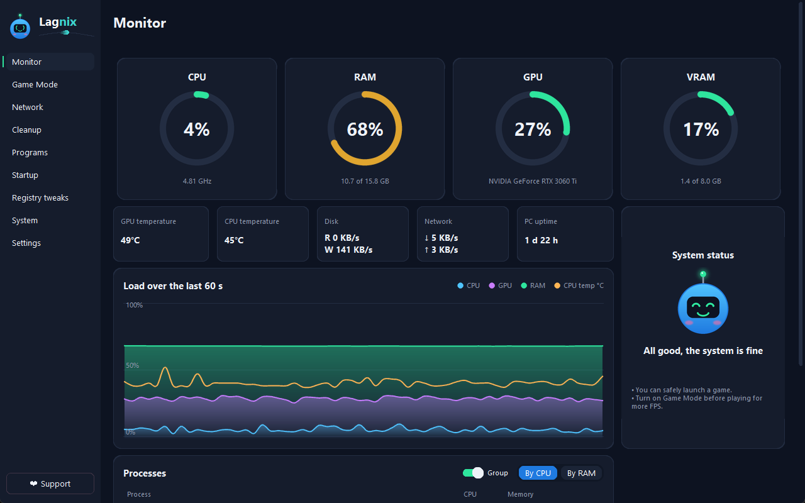 | 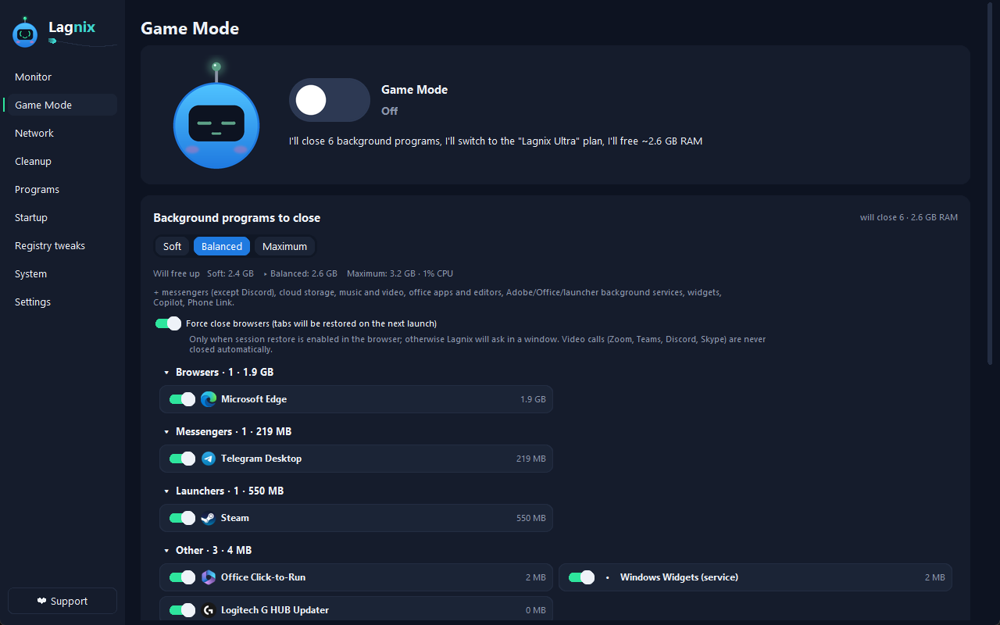 | 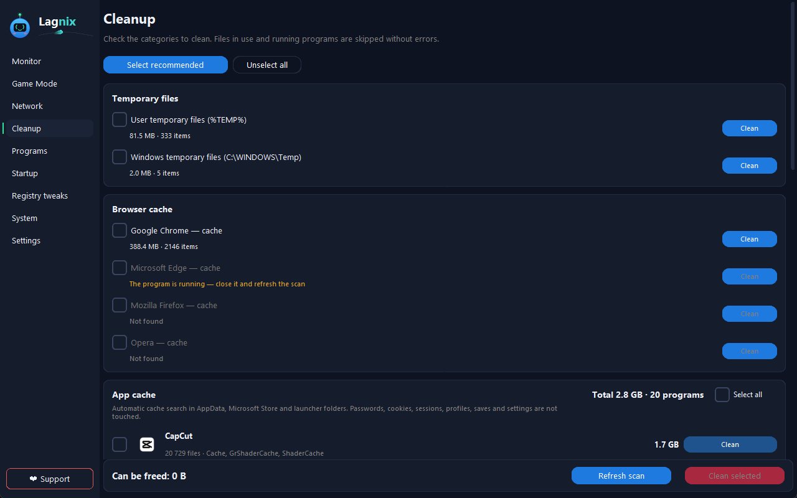 |

| Network | Programs | Registry tweaks |
|---|---|---|
| 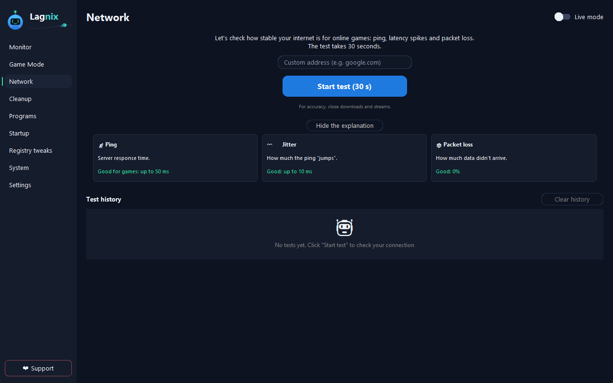 | 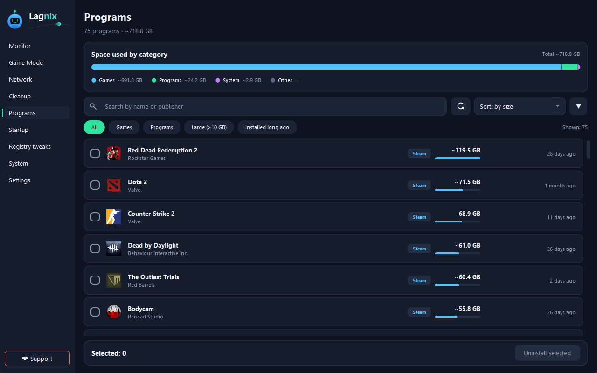 | 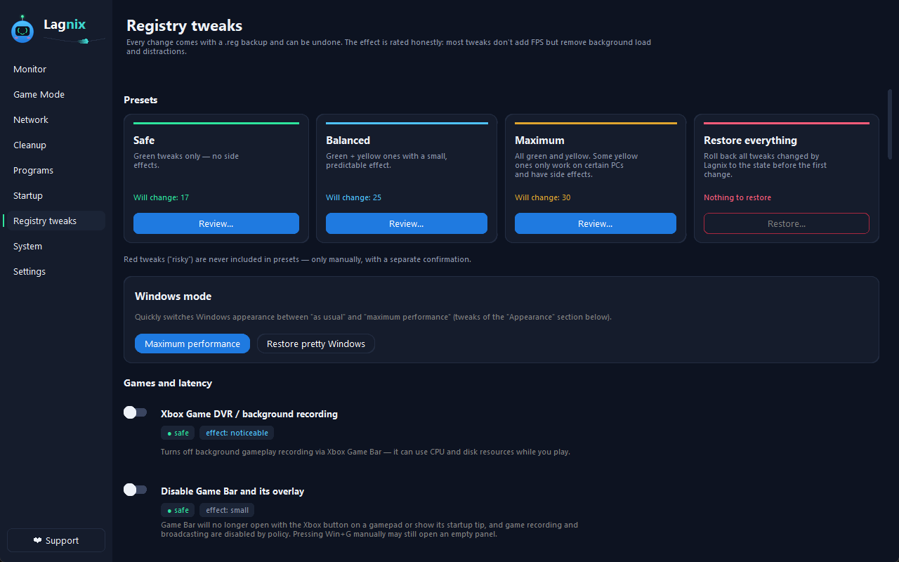 |

## Requirements

- Windows 10 or 11 (64-bit)
- Administrator rights (cleanup of system folders, power plans, registry tweaks, CPU temperature)
- To run from source: Python 3.12+

## Installation

- **Release:** download from [itch.io](https://lagnixapp.itch.io/lagnix) and run it.
- **From source:**
  ```
  pip install -r requirements.txt
  python main.py
  ```
  Set `LAGNIX_DEBUG=1` for debug output.

`settings.json` and `data.json` are created automatically on first run.

## Safety

- Registry changes are **backed up** first and can be reverted; a **system restore point** is offered before risky actions.
- Processes are closed or files deleted **only after you press a button and confirm**; scans are read-only.
- **Nothing is sent to the internet**, except the ping tests you run and the download of the PawnIO
  driver installer (CPU temperature) — only with your consent.
- Everything is stored locally next to the app (`settings.json`, `data.json`, `backups/`, `logs.txt`).

## Disclaimer

Lagnix is provided **"as is", without warranty of any kind**. System tweaks can affect your computer;
use them at your own risk and keep backups.

## License

[MIT](LICENSE). Third-party components: [THIRD_PARTY_LICENSES](THIRD_PARTY_LICENSES). See [CHANGELOG](CHANGELOG.md).

---

## Українська

Lagnix — безкоштовна утиліта для геймерів на Windows: монітор системи наживо, Ігровий режим,
тести мережі, очищення, керування автозапуском і безпечні твіки реєстру в одній невеликій програмі.

Підтримати автора: [Ko-fi](https://ko-fi.com/lagnix) · [itch.io](https://lagnixapp.itch.io/lagnix)

### Можливості

- **Монітор** — CPU, GPU, RAM, диски, мережа, температури, процеси, згруповані за програмами.
- **Ігровий режим** — закриває фонові програми, перемикає план живлення, профілі для ігор, автоувімкнення при запуску гри.
- **Мережа** — тести пінгу, джитера й втрат пакетів з історією.
- **Очищення** — тимчасові файли, кеші, пошук великих файлів.
- **Програми / Автозапуск** — видалення програм, увімкнення й вимкнення записів автозапуску.
- **Твіки реєстру** — оптимізації з автоматичними бекапами й точками відновлення.
- **Система** — інформація про залізо.
- **Оверлей** поверх ігор, глобальні **гарячі клавіші**, трей, сповіщення Windows.
- **12 мов** інтерфейсу, визначаються за Windows.

### Скріншоти

| Монітор | Ігровий режим | Очищення |
|---|---|---|
| 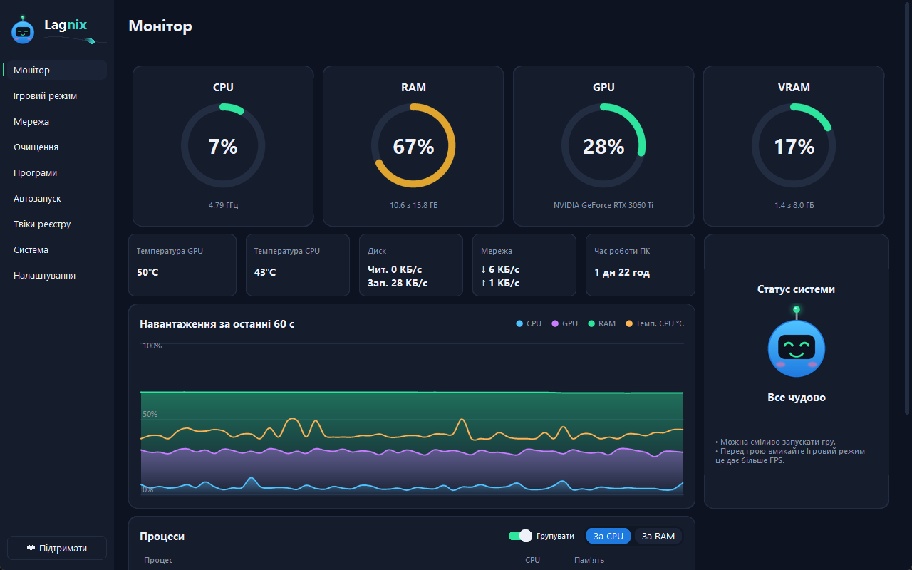 | 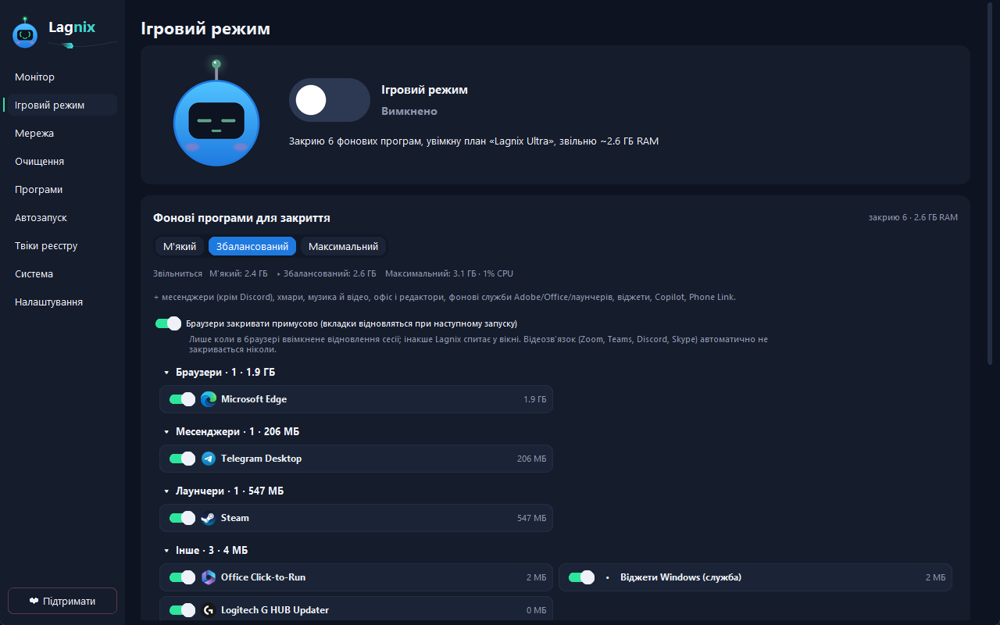 | 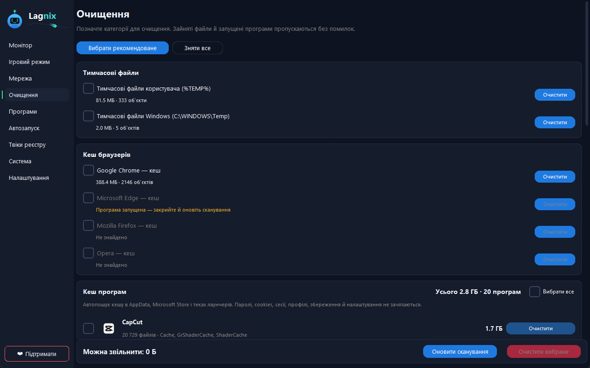 |

| Мережа | Програми | Твіки реєстру |
|---|---|---|
| 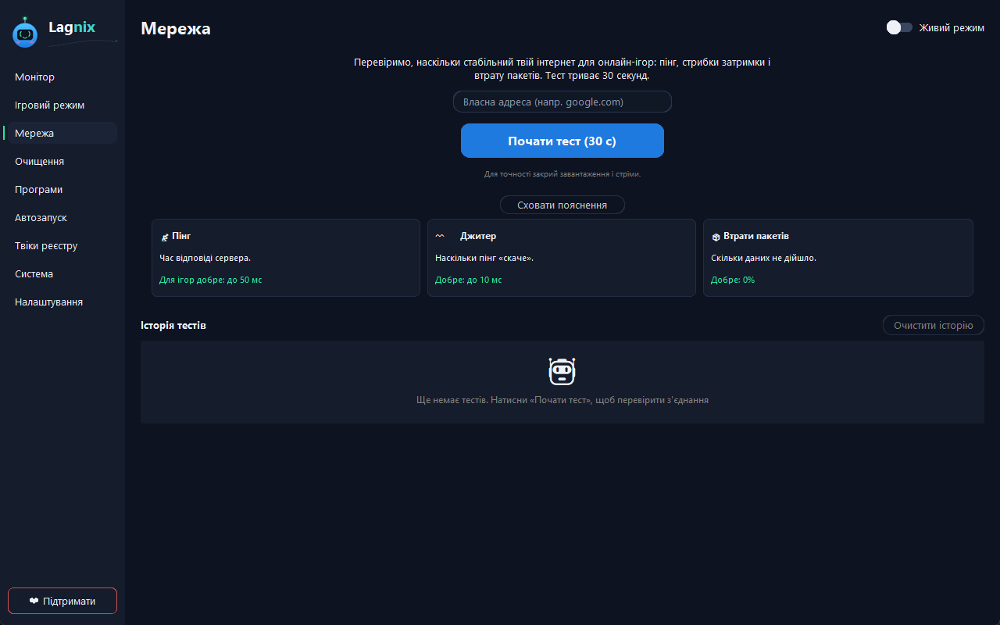 | 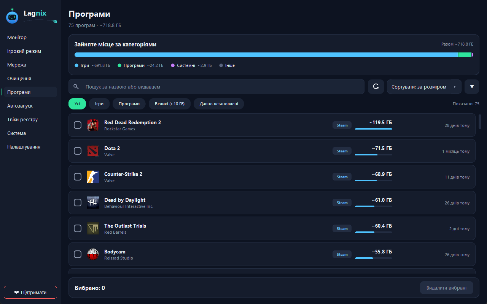 |  |

### Вимоги

- Windows 10 або 11 (64-біт)
- Права адміністратора (очищення системних тек, плани живлення, твіки реєстру, температура CPU)
- Для запуску з вихідного коду: Python 3.12+

### Встановлення

- **Реліз:** завантажте з [itch.io](https://lagnixapp.itch.io/lagnix) і запустіть.
- **З вихідного коду:**
  ```
  pip install -r requirements.txt
  python main.py
  ```
  `LAGNIX_DEBUG=1` вмикає налагоджувальний вивід.

`settings.json` і `data.json` створюються автоматично при першому запуску.

### Безпека

- Перед змінами реєстру робляться **бекапи**, їх можна відкотити; перед ризикованими діями пропонується **точка відновлення системи**.
- Процеси закриваються, а файли видаляються **лише після натискання кнопки й підтвердження**; сканування нічого не змінює.
- **Нічого не надсилається в інтернет**, окрім пінгу, який ви запускаєте, і завантаження інсталятора
  драйвера PawnIO (температура CPU) — лише за вашою згодою.
- Усе зберігається локально поруч із програмою (`settings.json`, `data.json`, `backups/`, `logs.txt`).

### Застереження

Lagnix надається **«як є», без жодних гарантій**. Системні твіки можуть вплинути на комп'ютер —
користуйтеся на власний ризик і робіть резервні копії.

### Ліцензія

[MIT](LICENSE). Сторонні компоненти: [THIRD_PARTY_LICENSES](THIRD_PARTY_LICENSES). Див. [CHANGELOG](CHANGELOG.md).
